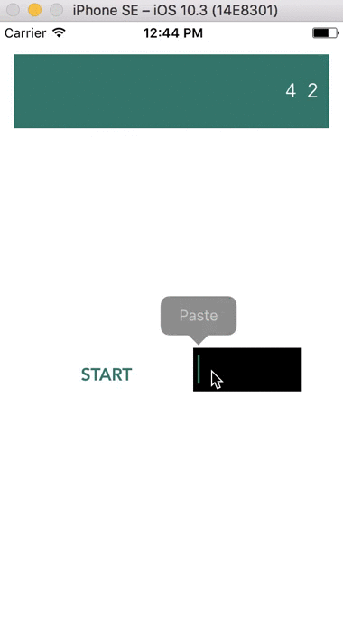

# NumbersSlotMachine

## Preview
A UIView for numbers changing animation


## Usage

```
    nsm = NumbersSlotMachine()
    nsm.frame = CGRect(x: 15, y: 30, width: self.view.bounds.width - 30, height: self.view.bounds.height - 500)
    nsm.backgroundColor = UIColor(red:0.17, green:0.43, blue:0.42, alpha:1.0)
    nsm.downRoll = true
    nsm.incrementRoll = true
    self.view.addSubview(nsm)
```

Add a button and a textview for entering numbers:

```       
    let button = UIButton(type: .system)
    button.frame = CGRect(x: 50.0, y: 300.0, width: 100.0, height: 50.0)
    button.setTitle("START", for: .normal)
    button.titleLabel?.font = UIFont(name: "Avenir-heavy", size: 16)
    button.setTitleColor(UIColor(red:0.17, green:0.43, blue:0.42, alpha:1.0), for: .normal)
    button.addTarget(self, action: #selector(roll), for: .touchUpInside)
    self.view.addSubview(button)

    inputText = UITextView(frame: CGRect(x: 180.0, y: 300.0, width: 100.0, height: 40.0))
    inputText.backgroundColor = .black
    inputText.textColor = .white
    inputText.font = UIFont(name: "Avenir", size: 18)
    inputText.tintColor = UIColor(red:0.17, green:0.43, blue:0.42, alpha:1.0)
    self.view.addSubview(inputText)
```

```
    func roll() {
        if let input = inputText.text {
            let digit = Int(input)
            nsm.setIntger(input: digit!)
        } else {
            print ("inpurt nil")
        }
    }
```
